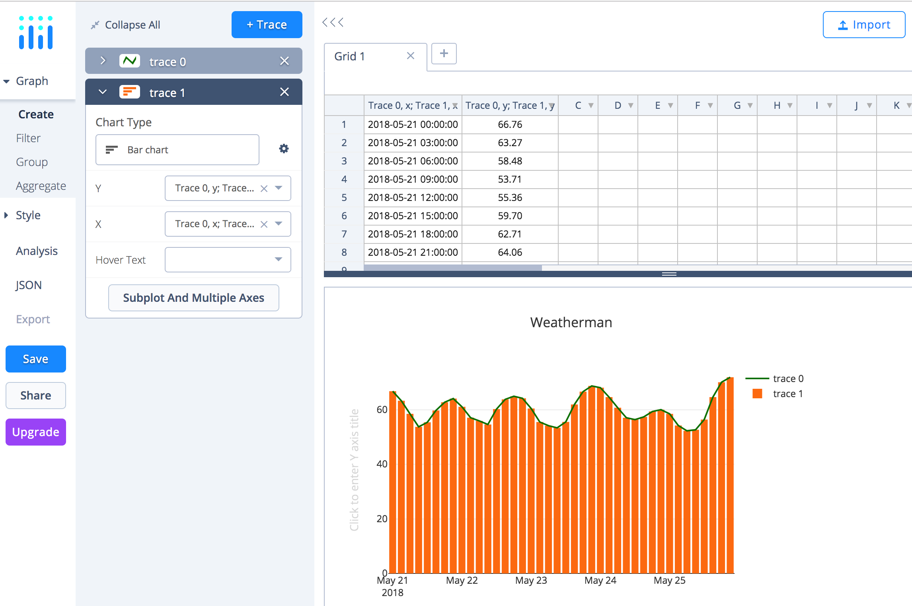

Weatherman App

### REACT-REDUX
React weather data plot application 

### HOWTO
* clone `git clone https://github.com/ObjectMatrix/weatherman`  
* `npm install`  
* `nodemon`  
* Browsee to `http://localhost:3000`  
* Now type in: City, Country: `San Francisco, USA` and click Button `fetch`  

